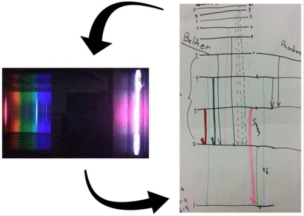

# What is this experiment about?

This experiment reformulates a well-known experiment in the physical chemistry laboratory, hydrogen atom emission spectroscopy, into a guided inquiry experiment.  The experiment’s key feature is iterative model building, where students develop an initial model of energy levels and keep revising their model upon presentation of additional experimental information.  Students should know about the general concept of energy levels and the electromagnetic spectrum.  This experiment can (and perhaps should) be done before any discussion of hydrogen energy levels in physical chemistry.

# What do students do?

The full experiment consists of three cycles. Students first perform low-resolution observations using a handheld diffraction grating or similar and, in teams, build an energy level diagram consistent with their observations.  Next, students perform high-resolution emission spectroscopy, compare their data with others, and use data to refine and expand their model.  Finally, students are provided with additional data (from spectrometers not commonly available) and again in teams refine and expand their model.  Completing all three cycles typically requires two three-hour lab periods.

# What equipment and supplies will you need?

Hydrogen discharge tubes; handheld diffraction gratings or similar devices
Small emission spectrometers (several possibilities described in Instructor Handbook)
What makes this experiment a physical chemistry experiment?
This experiment highlights key features of atomic spectroscopy and atomic energy levels.  While students have likely seen a diagram of hydrogen atom energy levels in introductory chemistry, they are much less likely to have built the model themselves directly from data - some of which they obtain themselves in this experiment.  Students make use of both frequency and intensity information from spectra as they construct increasingly detailed models of hydrogen energy levels.

# And what makes it a POGIL-PCL experiment?

Students make predictions about the behavior of emitting atoms, testing those predictions against experimental results they obtain. In doing so, students engage in experimental design and decision-making to determine instrumental parameters to use, and they share data among the class to ensure consistency and collectively decide which spectral lines, if any, may be due to contaminants. Students use graphical representations to explore the results and apply, modify, and extend schematic models.  The focus of this experiment is iterative model building directly from data, including making decisions about how to modify a previously successful model in light of new experimental evidence that does not appear to fit, rather than verification of the Rydberg constant or other known parameters.

KEYWORDS: Undergraduate Physical Chemistry Laboratory, Atomic Structure, Guided Inquiry Learning, Hydrogen Emission Spectrum, Constructivist Iterative Model Building

# Reference

Steven M. Singleton, Craig M. Teague, and Carl Salter, Journal of Chemical Education 2022 99 (12), 4143-4148, [DOI: /10.1021/acs.jchemed.2c00348](https://doi.org/10.1021/acs.jchemed.2c00348)

[Google drive folder](https://drive.google.com/drive/folders/0BwUsdna_LmGjTlByeTBaQXZTdm8?resourcekey=0-5PO-3jXo2D3LmQC7htuKRg)

[Student Handbook](https://drive.google.com/file/d/1EhYn2OQi54VAbDQyMm-qdCPtiC3g4Mle/view?usp=drive_link)

Instructor&rsquo;s handbook available by request.

