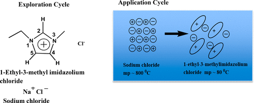

The topic of ionic liquids is typically not taught at the undergraduate level. Many properties, such as conductivity, vapor pressure, and viscosity, of these so-called “green solvents” are unique compared to traditional molecular solvents. Using active learning techniques, we introduced an ionic liquid module in the physical chemistry laboratory where their structures and physical properties, namely, viscosity, conductivity, and vapor pressure, were explored in relation to molecular solvents. Summative and formative assessments show that a majority of the participants were able to grasp the key concepts of ionic liquids. We envision that our methods and strategies can be one of the building blocks of introducing ionic liquids into the undergraduate chemistry curriculum.

# Reference

Kevin E. Riley and Samrat Dutta, Journal of Chemical Education, 2024, [doi:10.1021/acs.jchemed.3c00871](https://doi.org/10.1021/acs.jchemed.3c00871)

