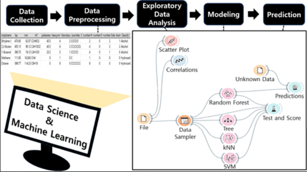

Artificial intelligence (AI) and data science (DS) are receiving a lot of attention in various fields. In the educational field, the need for education utilizing AI and DS is also being emerged. In this context, we have created an AI/DS integrating program that generates a compound classification/regression model using characteristics of compounds and predicts classification and boiling points of compounds from an unknown dataset. Students have experienced data collection and preprocessing, exploratory data analysis, modeling, and prediction. The No-Code-Low-Code Orange3 tool has been used for the process of modeling and prediction so that even beginners can easily perform Machine Learning (ML) analysis. The raw dataset containing 24 characteristics for 277,569 compounds went through data preprocessing process and became a well-refined dataset. The Random Forest model accurately predicted whether the type of compound in the unknown dataset was hydrocarbons, alcohols, or amines and predicted the boiling points of the some arbitrary compounds within the average error range of 4.49K. This activity will provide meaningful implications for how AI/DS technology could be integrated into each domain.

# Reference

Shin-Yu Kim, Inseong Jeon, and Seong-Joo Kang, Journal of Chemical Education,
[DOI: 10.1021/acs.jchemed.3c01040](https://doi.org/10.1021/acs.jchemed.3c01040)

