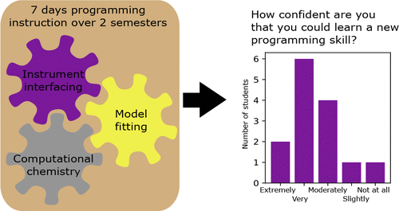

This paper shows a method for integrating computer programming into a standard physical chemistry laboratory sequence to augment student data analysis abilities and allow them to carry programming skills forward to other courses. The Python programming language is used, taking advantage of the pedagogical benefits of Jupyter notebooks, primarily the ability to intersperse instructions and interactive code cells. A series of five notebooks, plus one traditional script exercise, are designed to teach basic techniques (e.g., loops, assignments, data types), instrument interfacing, model fitting, and introductory quantum chemistry. The skills are directly applicable to laboratories the students perform during the hands-on portion of the courses. A survey of students who have completed the course show high confidence in their ability to learn new skills, and student comments reveal they have used these skills in a variety of other contexts.

# Reference

van Staveren M.,  *ChemRxiv* 2022; <https://doi.org/10.26434/chemrxiv-2022-09k30>

Marie van Staveren, *J. Chem. Educ.*, 2022, 99, 7, 2604–2609,
[doi.org/10.1021/acs.jchemed.2c00193](https://doi.org/10.1021/acs.jchemed.2c00193)

