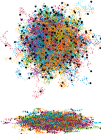

The process of diffusion is intimately related to random molecular displacement and is central to many problems in chemistry. Here, we provide an intuitive derivation of the diffusion equation based on the analysis of the random trajectories of particles generated and plotted by simple MATLAB and Python scripts. The codes are very simple and profusely commented on, so they can be modified by students and instructors with little experience with these software packages. The codes plot the trajectories in 1D, 2D, and 3D of a number of particles during a number of steps, both specified by the operator. Advanced versions of the codes with animated evolution of the diffusion process are also provided. The interactive generation and analysis of the trajectories of the particles in different scenarios allows a faster and more complete understanding of the effect of the number of particles, diffusion time, or dimensionality of the system, on the basic aspects of chemical diffusion, like mean square displacement, through the statistical nature of the process. A series of activities for the instructor and students was also suggested.

# Reference

Victor Leborán and Francisco Rivadulla, Journal of Chemical Education Article ASAP

[10.1021/acs.jchemed.3c00309](https://doi.org/10.1021/acs.jchemed.3c00309)

KEYWORDS: Upper-Division Undergraduate, Computer-Based Learning, Chemical Diffusion

