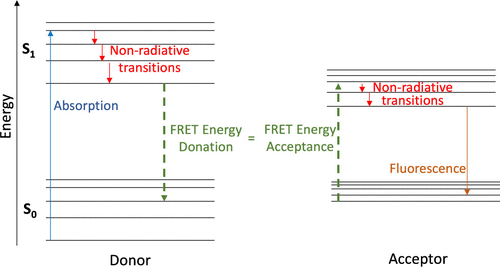

Including biophysical lab activities in physical chemistry laboratory courses gives students exposure to a growing field and fosters connections between courses, and using a Process-Oriented Guided Inquiry Learning–Physical Chemistry Laboratory (POGIL–PCL) approach offers an active, student-centered opportunity for students to engage with several scientific practices. In this paper, we share a POGIL–PCL experiment that was developed around the concept of fluorescence resonance energy transfer (FRET). FRET is an interesting and powerful spectroscopic technique that can be used to elucidate intramolecular distances. This experiment introduces upper-level undergraduate students to the theory of FRET and allows them to measure the heme–tryptophan Förster distance using fluorescence and UV–vis spectral data of the cytochrome c protein. Over the course of the experiment, students have the opportunity to engage with the scientific practices such as developing and using models, using mathematics and computational thinking, and constructing explanations.

# Reference

Jordan P. Beck, Diane M. Miller, Andrea A. Carter, *J. Chem. Educ.*, 2026, [doi.org/10.1021/acs.jchemed.5c01226](https://doi.org/10.1021/acs.jchemed.5c01226)

