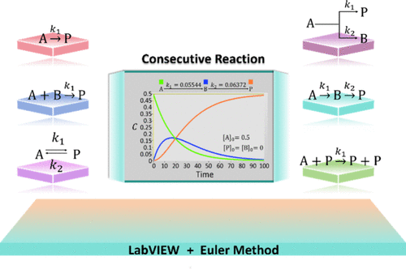

A chemical reaction kinetics simulation program was developed to simulate both simple and complex reactions with LabVIEW. In the case of simple reactions, the focus is on the kinetic characteristics of dual-reactant systems with different stoichiometric ratios at initial concentrations. For complex reactions, the characteristics of parallel, consecutive, reversible, and autocatalytic reactions are discussed. The numerical simulations from the program are close to the analytical solutions and can effectively reflect the kinetic characteristics of different types of reactions. The effectiveness of the simulation program in promoting learning was verified by experimental and control groups, and the score rate of the experimental group (89.7%) was significantly higher than that of the control group (66.6%). The results indicate that, with the help of the program, students can better construct the differential equations based on the law of mass action and understand the kinetic plots of different reactions as well as the relationship between the rates of the substance and the chemical reaction.

# Reference

Li Liu, Qiang Fu, Qingsheng Gao, *J. Chem. Educ*., 2025, [doi.org/10.1021/acs.jchemed.4c01332](https://doi.org/10.1021/acs.jchemed.4c01332)

