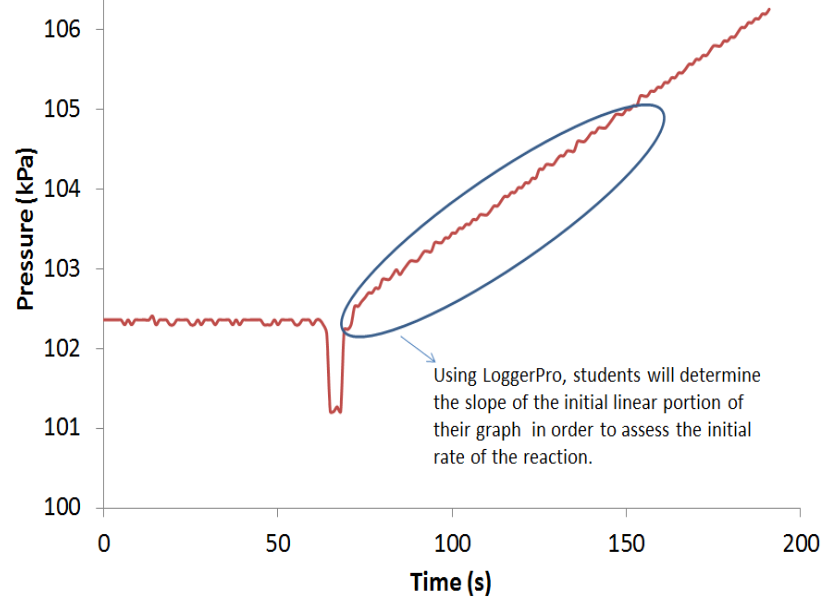

Heterogeneous reactions are examples of the economically important corrosion
process. The reaction studied in this experiment is the oxidation of magnesium
by dilute hydrochloric acid. Studying the rate of this or any reaction provides
valuable insight into how the reaction takes place.

# Learning objectives

Process objectives

-   Develop the ability to convert a relationship into a linear form and apply that relationship, demonstrating the ability to linearize a relationship.
-   identify the dependent and independent variables in a linear relation and relate these variables to measurable quantities in the lab.
-   locate the desired properties from a linearized, graphed relationship using the slopeand intercept.

Content objectives

-   choose experimental parameters that allow determination of the rate law of an experiment, demonstrating the ability to understand and use the initial rates method
-   apply the initial rates method to a heterogeneous reaction
-   choose experimental parameters that allow determination of a reaction’s activation energy, demonstrating the ability to use experimental data and the Arrhenius equation to determine a reaction’s activation energy.

# Timing

This experiment takes two lab periods, each at least three hours long (the
instructor will need to push some students to get done within three hours,
depending on how much time is spent in discussion). The first lab period is used
to determine the form of Mg, and it gives students practice with the apparatus.
Time is also spent making solutions. The second lab period is used to determine
the orders of the reaction and the activation energy.

# Reference

Sally Hunnicutt, Virginia Commonwealth University

[View student version](https://chemistry.coe.edu/piper/pclform.html?expt=MgHCl)

The Instructor’s Handbook with implementation details, sample data, and expected answers is available through the [POGIL-PCL project](https://www.pogilpcl.org/get-connected). 

