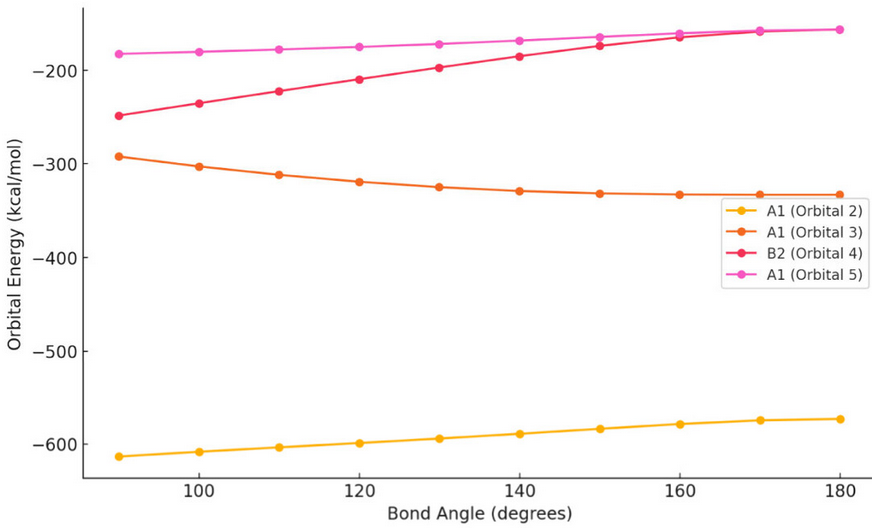

Large language models (LLMs) are positioned to transform how students interact with data in classroom and laboratory settings, both now and in the future. The integration of LLMs into chemical curricula, if done effectively, may improve student equity and learning outcomes and provide an alternative approach to data analysis alongside traditional methods. One of the key strengths of LLMs is their ability to efficiently summarize large data sets and transform them into understandable forms. Although the ability of LLMs to help students process qualitative data is well established, here we focus on use of LLMs to process quantitative data and, specifically, make high-quality data plots without relying exclusively on spreadsheet skills. Specifically, we tested the ability of OpenAI’s ChatGPT to plot Walsh diagrams relevant to an ongoing laboratory experiment conducted in an undergraduate inorganic chemistry course. It was found that the LLM could generate high-quality graphs from raw data with appropriate prompts. Furthermore, the LLM was able to parse long computational output files to extract relevant data as well as perform multivariate linear regression. A pilot experiment integrating LLMs as a tool to generate graphs from complex data sets into a 300-level inorganic chemistry laboratory showed that ∼60% of the students considered LLMs as an efficient tool for data analysis, ∼40% felt the tool significantly enhanced their learning, and ∼5% experienced frustration. Introducing LLMs as a supplementary tool for data processing could help students who struggle with spreadsheet software without replacing essential spreadsheet skills that are fundamental to training the STEM workforce. Implementation of LLMs as a data processing tool may bring about equitable outcomes in quantitative chemistry courses regardless of students’ prior experience with spreadsheet software.

# Reference

S. M. Supundrika Subasinghe, Simon G. Gersib, Neal P. Mankad, *J. Chem. Educ.*, 2025, [doi.org/10.1021/acs.jchemed.4c01498](https://doi.org/10.1021/acs.jchemed.4c01498) 

