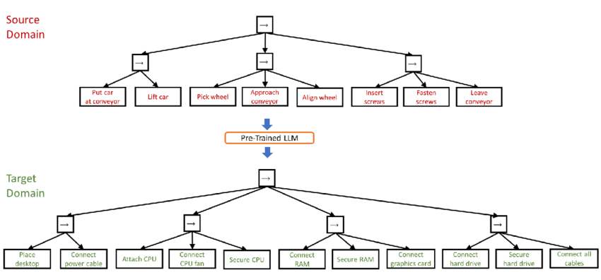

# 

# &ldquo;SciBench: Evaluating College-Level Scientific Problem-Solving Abilities of Large Language Models&rdquo;

Xiaoxuan Wang, et al, arXiv Computer Science, <https://arxiv.org/abs/2307.10635>

Abstract: Recent advances in large language models (LLMs) have demonstrated notable progress on many mathematical benchmarks. However, most of these benchmarks only feature problems grounded in junior and senior high school subjects, contain only multiple-choice questions, and are confined to a limited scope of elementary arithmetic operations. To address these issues, this paper introduces an expansive benchmark suite SciBench that aims to systematically examine the reasoning capabilities required for complex scientific problem solving. SciBench contains two carefully curated datasets: an open set featuring a range of collegiate-level scientific problems drawn from mathematics, chemistry, and physics textbooks, and a closed set comprising problems from undergraduate-level exams in computer science and mathematics. Based on the two datasets, we conduct an in-depth benchmark study of two representative LLMs with various prompting strategies. The results reveal that current LLMs fall short of delivering satisfactory performance, with an overall score of merely 35.80%. Furthermore, through a detailed user study, we categorize the errors made by LLMs into ten problem-solving abilities. Our analysis indicates that no single prompting strategy significantly outperforms others and some strategies that demonstrate improvements in certain problem-solving skills result in declines in other skills. We envision that SciBench will catalyze further developments in the reasoning abilities of LLMs, thereby ultimately contributing to scientific research and discovery.

# &ldquo;Challenging ChatGPT with Chemistry-Related Subjects&rdquo;

Pimentel, et al <https://doi.org/10.26434/chemrxiv-2023-xl6w3> (unreviewed)

Abstract: Tools based on large language models such as ChatGPT may revolutionize information retrieval and knowledge discovery, particularly with the vast amount of electronic material available. In this communication we evaluate how two versions of ChatGPT can answer complex questions on chemistry-related subjects in six topics. The tools are still insufficient to deal with subtleties of complex topics, especially as they do not have access to the whole of the scientific literature. However, the progress from ChatGPT-3 to ChatGPT-4 is an indicator that we shall soon have tools to assist scientists in surveys, reviews of the literature, and for teaching.

# &ldquo;Do Large Language Models Understand Chemistry? A Conversation with ChatGPT&rdquo;

Pimentel, et al,Journal of Chemical Information and Modeling 2023 63 (6), 1649-1655,  <https://doi.org/10.1021/acs.jcim.3c00285>

Abstract: Large language models (LLMs) have promised a revolution in answering complex questions using the ChatGPT model. Its application in chemistry is still in its infancy. This viewpoint addresses the question of how well ChatGPT understands chemistry by posing five simple tasks in different subareas of chemistry.

# &ldquo;Generative AI in Education and Research: Opportunities, Concerns, and Solutions&rdquo;

Alasadi & Baiz, J. Chem. Educ. 2023, 100, 8, 2965–2971, <https://doi.org/10.1021/acs.jchemed.3c00323>

Abstract: In this article, we discuss the role of generative artificial intelligence (AI) in education. The integration of AI in education has sparked a paradigm shift in teaching and learning, presenting both unparalleled opportunities and complex challenges. This paper explores critical aspects of implementing AI in education to advance educational goals, ethical considerations in scientific publications, and the attribution of credit for AI-driven discoveries. We also examine the implications of using AI-generated content in professional activities and describe equity and accessibility concerns. By weaving these key questions into a comprehensive discussion, this article aims to provide a balanced perspective on the responsible and effective use of these technologies in education, highlighting the need for a thoughtful, ethical, and inclusive approach to their integration.

# &ldquo;Exploring the use of large language models (LLMs) in chemical engineering education: Building core course problem models with Chat-GPT&rdquo;

Meng-Lin Tsai, et al, Education for Chemical Engineers,  <https://doi.org/10.1016/j.ece.2023.05.001>

Abstract: This study highlights the potential benefits of integrating Large Language Models (LLMs) into chemical engineering education. In this study, Chat-GPT, a user-friendly LLM, is used as a problem-solving tool. Chemical engineering education has traditionally focused on fundamental knowledge in the classroom with limited opportunities for hands-on problem-solving. To address this issue, our study proposes an LLMs-assisted problem-solving procedure. This approach promotes critical thinking, enhances problem-solving abilities, and facilitates a deeper understanding of core subjects. Furthermore, incorporating programming into chemical engineering education prepares students with vital Industry 4.0 skills for contemporary industrial practices. During our experimental lecture, we introduced a simple example of building a model to calculate steam turbine cycle efficiency, and assigned projects to students for exploring the possible use of LLMs in solving various aspect of chemical engineering problems. Although it received mixed feedback from students, it was found to be an accessible and practical tool for improving problem-solving efficiency. Analyzing the student projects, we identified five common difficulties and misconceptions and provided helpful suggestions for overcoming them. Our course has limitations regarding using advanced tools and addressing complex problems. We further provide two additional examples to better demonstrate how to integrate LLMs into core courses. We emphasize the importance of universities, professors, and students actively embracing and utilizing LLMs as tools for chemical engineering education. Students must develop critical thinking skills and a thorough understanding of the principles behind LLMs, taking responsibility for their use and creations. This study provides valuable insights for enhancing chemical engineering education&rsquo;s learning experience and outcomes by integrating LLMs.

# &ldquo;ChatGPT in physics education: A pilot study on easy-to-implement activities&rdquo;

Bitzenbauer, Cont. Ed. Tech., 15, 3, <https://doi.org/10.30935/cedtech/13176>

Abstract: Large language models, such as ChatGPT, have great potential to enhance learning and support teachers, but they must be used with care to tackle limitations and biases. This paper presents two easy-to-implement examples of how ChatGPT can be used in physics classrooms to foster critical thinking skills at the secondary school level. A pilot study (n=53) examining the implementation of these examples found that the intervention had a positive impact on students’ perceptions of ChatGPT, with an increase in agreement with statements related to its benefits and incorporation into their daily lives.

# &ldquo;Assessment of chemistry knowledge in large language models that generate code&rdquo;

White, et al, Digital Discovery, 2023,2, 368-376,  <https://doi.org/10.1039/D2DD00087C>, unreviewed preprint: <https://doi.org/10.26434/chemrxiv-2022-3md3n-v2>

Abstract: In this work, we investigate the question: do code-generating large language models know chemistry? Our results indicate, mostly yes. To evaluate this, we introduce an expandable framework for evaluating chemistry knowledge in these models, through prompting models to solve chemistry problems posed as coding tasks. To do so, we produce a benchmark set of problems, and evaluate these models based on correctness of code by automated testing and evaluation by experts. We find that recent LLMs are able to write correct code across a variety of topics in chemistry and their accuracy can be increased by 30 percentage points via prompt engineering strategies, like putting copyright notices at the top of files. Our dataset and evaluation tools are open source which can be contributed to or built upon by future researchers, and will serve as a community resource for evaluating the performance of new models as they emerge. We also describe some good practices for employing LLMs in chemistry. The general success of these models demonstrates that their impact on chemistry teaching and research is poised to be enormous.

# &ldquo;Natural language processing models that automate programming will transform chemistry research and teaching&rdquo;

Hocky and White, Digital Discovery, 2022, 1, 79-83, <https://doi.org/10.1039/D1DD00009H>

Abstract: Natural language processing models have emerged that can generate useable software and automate a number of programming tasks with high fidelity. These tools have yet to have an impact on the chemistry community. Yet, our initial testing demonstrates that this form of artificial intelligence is poised to transform chemistry and chemical engineering research. Here, we review developments that brought us to this point, examine applications in chemistry, and give our perspective on how this may fundamentally alter research and teaching.

# &ldquo;What is ChatGPT doing&#x2026;and why does it work?&rdquo;

Stephen Wolfram Writings: <https://writings.stephenwolfram.com/2023/02/what-is-chatgpt-doing-and-why-does-it-work/>

YouTube video: <https://youtu.be/flXrLGPY3SU?t=575>

KEYWORDS: GPT, ChatGPT, LLM, teaching, chemistry

# Future Trends Forum: Discussing the future of education and technology

Bryan Alexander, [Future Trends Forum](http://forum.futureofeducation.us/about/) YouTube video series on AI

-   [How can we teach creatively with AI?](https://www.youtube.com/watch?v=vrxNpMnVeFc)
    
    Depauw University professor Harry Brown describes and shows his class experiments.

-   [How should academics react to AI?](https://www.youtube.com/watch?v=UDx0jksjVwM)
    
    How should higher education respond to new developments in artificial intelligence, such as ChatGPT and image creating applications?

-   [How might Higher Education respond to AI?](https://www.youtube.com/watch?v=jCOQ-pWoMyY)
    
    Computer scientist and ed tech leader Ruben Puentedura explores the implications of large language model artificial intelligence.

-   [Open Source AI for Higher Education](https://www.youtube.com/watch?v=crBPM6DGQCQ&list=PLlcx8yl6hlPC3QjlbIHzxGqCP3qRa0zcg&index=2)
    
    How can higher education grapple with artificial intelligence? We
    ask this question with a focus on an underdiscussed aspect: open
    source AI.  Our guide is the excellent Forum favorite, computer
    scientist Ruben R. Puentedura, widely known as the creator of the
    SAMR framework for understanding the intersection of teaching and
    tech.

