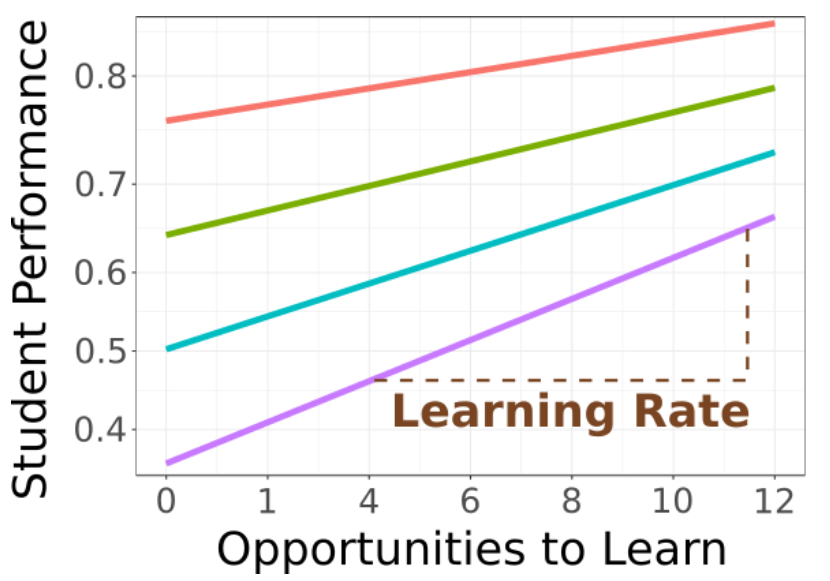

Research spanning nearly a century has found that math plays an important role in the learning of chemistry. Here, we use a large dataset of student interactions with online courseware to investigate the details of this link between math and chemistry. The activities in the courseware are labeled against a list of knowledge components (KCs) covered by the content, and student interactions are tracked over a full semester of general chemistry at a range of institutions. Logistic regression is used to model student performance as a function of the number of opportunities a student has taken to engage with a particular KC. This regression analysis generates estimates of both the initial knowledge and the learning rate for each student and each KC. Consistent with results from other domains, the initial knowledge varies substantially across students, but the learning rate is nearly the same for all students. The role of math is investigated by labeling each KC with the level of math involved. The overwhelming result from regressions based on these labels is that only the initial knowledge varies strongly across students and across the level of math involved in a particular topic. The student learning rate is nearly independent of both the level of math involved in a KC and the prior mathematical preparation of an individual student. The observation that the primary challenge for students lies in initial knowledge, rather than learning rate, may have implications for course and curriculum design.

# Reference

Koedinger KR, Blaser M, McLaughlin EA, Cheng H, Yaron DJ., *ChemRxiv.* 2024, [doi:10.26434/chemrxiv-2024-bms6x](https://doi:10.26434/chemrxiv-2024-bms6x) This content is a preprint and has not been peer-reviewed.

