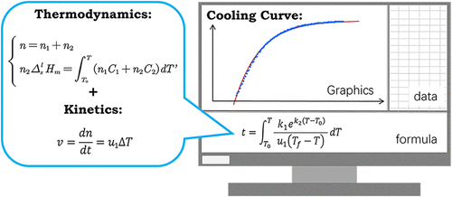

Cooling curves of melts provide a wealth of information regarding latent heat, heat transfer, the Gibbs phase rule, and mass transfer kinetics during phase transition. In this study, a computer-based activity was designed to deepen upper-level undergraduate students’ comprehension of the intricate phase transition process. This activity primarily employs mathematical modeling methods based on conservation of energy and crystallization kinetic equations to derive a mathematical relationship between temperature and time during the supercooling phase transition of a single-component metal. Mathematics teaching software GeoGebra was utilized for graphing and comparing the derived mathematic model with experimental data. Following the activity, students’ learning outcomes were evaluated using a questionnaire. The average score was 86.87 for the first round of students and 88.26 for the second round of students. Incorporating mathematical modeling of cooling curves into physical chemistry laboratory teaching has resulted in noticeable enhancement in the student’s learning. Overall, this activity effectively enhanced students&rsquo; comprehension of mathematical modeling, computational skills, and problem solving skills. The activity significantly enriches students&rsquo; comprehensive understanding of cooling curves and associated experiments in physical chemistry.

# Reference

Bojun Shi, Ruixin Liao, Yuai Duan, Jing Yuan, Zhanfang Ma, *J. Chem. Ed.*, 2024 [DOI: 10.1021/acs.jchemed.4c00876](https://doi.org/10.1021/acs.jchemed.4c00876)

