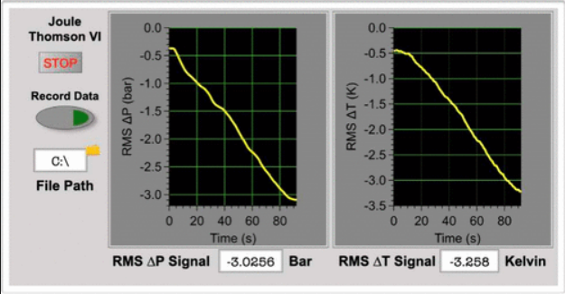

A novel approach to exposing students to electronic data acquisition, LabVIEW programming, and experimental design is described herein. This is achieved through the measurement of the Joule-Thomson coefficient of nitrogen and carbon dioxide using a student-built apparatus with slight and convenient adjustments to a classic literature apparatus. A detailed pedagogical approach in the instruction of LabVIEW is described, which may be performed at home, in a computer laboratory, or the physical chemistry laboratory depending on the availability of resources. Additionally, a range of levels of inquiry are described for the instructional mode. Finally, using the methodology described past student groups have been able to determine the Joule-Thomson coefficient of carbon dioxide to be 1.023 ± 0.134 K bar-1, respectively, which is in excellent agreement with the literature.

# Reference

Christopher W. Harmon,
Journal of Chemical Education ASAP,
[DOI: 10.1021/acs.jchemed.3c00849](https://doi.org/10.1021/acs.jchemed.3c00849)

