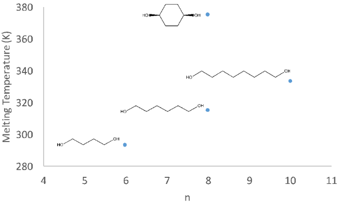

# What is this experiment about?

Students predict how various factors affect the melting point, and make connections to enthalpy and entropy of fusion.

# What do students do?

Students tend to have a preconception that melting is very similar to boiling—that is, melting point is determined exclusively by IMFs. In this experiment, students consider various sets of molecules designed to allow them to discover that they will need to take into account additional factors. Students will predict the effects of flexibility, polarity, molecular size, and symmetry on melting point, and explain how these parameters affect the enthalpy and entropy of fusion. Students work together to look up values and model data, and they periodically report out to the class. Note that this experiment is a dry activity–students find data on the NIST Chemistry Webbook (and also use computational modeling software to visualize a few of the molecules). Students can apply what they’ve learned to design molecules with high or low melting point (post-experiment questions).

# What equipment and supplies will you need?

Electronic devices with access to the internet (to look up data on NIST Chemistry Webbook). The molecular modeling will require Spartan, webMO, or another similar program (note: a plastic model kit may also work, but before using it, verify that it is flexible enough to build cubane, with its high angle strain).

# What makes this experiment a physical chemistry experiment?

Students consider how melting point is impacted by molecular parameters, and, consequently, make the connection between melting point and enthalpy and entropy of fusion.

# And what makes it a POGIL-PCL experiment?

Students make predictions, share and interact with other students, model their data to draw conclusions, and demonstrate their understanding of developed concepts.

# Reference

John Hagan, California Polytechnic State University

Student handout and Instructor’s Handbook are available through the POGIL-PCL project: <https://www.pogilpcl.org/get-connected>
KEYWORDS:

