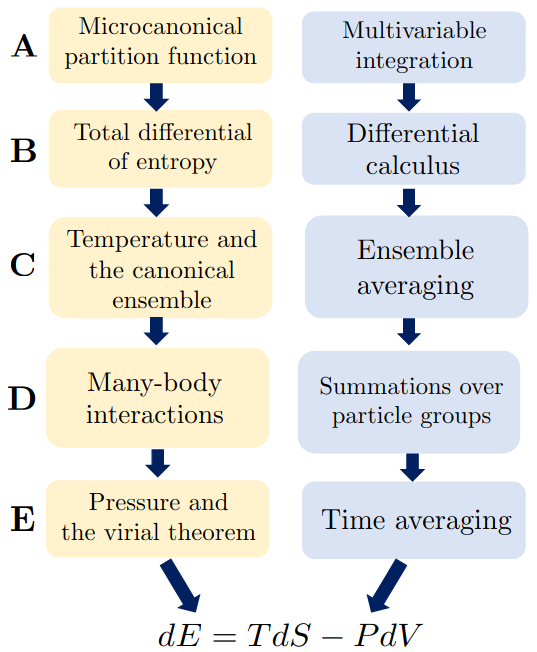

Thermodynamics forms an important part of the chemistry and chemical engineering curriculum at the undergraduate and graduate levels. Over the years, the importance of statistical mechanics and molecular simulations in the curriculum has increased, especially at the graduate level. Given this shift, in this work, we utilize the microcanonical ensemble, which is typically considered to be intractable, and show that it is helpful to employ it as a pedagogical tool that demonstrates the consistency of microcanonical statistical mechanics with the combined first and second law of thermodynamics. We start with Boltzmann&rsquo;s entropy formula and use differential calculus to establish that dE=TdS - PdV for an isolated, nonideal fluid in an arbitrary number of dimensions, with a constant number of particles (N), volume (V), and energy (E), and with temperature T, pressure P, and entropy S. To this end, we write the partition function for an isolated monoatomic fluid. Further, we derive the average of the inverse kinetic energy, which appears in the formulation of the combined first and second law, and show that it is equal to the inverse of the average kinetic energy, thus introducing the system&rsquo;s temperature (T). Subsequently, we obtain an expression for the pressure (P) of a system involving many-body interactions and introduce the system pressure in the combined first and second law via Clausius&rsquo;s virial theorem. We discuss how intermolecular interactions affect the entropy and pressure of a thermodynamic system. Overall, we inform the derivation of the fundamental thermodynamic relationship dE=TdS-PdV using an isolated (microcanonical) system, thereby providing deeper insight into equilibrium statistical thermodynamics. Indeed, we demonstrated that this material resulted in favorable learning outcomes when taught as a 1.5-hour lecture. Accordingly, the material presented here may be incorporated into graduate-level courses on statistical mechanics and/or molecular simulations in various disciplines, including chemistry and physics, as well as chemical, materials, and mechanical engineering.

# Reference

Govind Rajan A.  ChemRxiv. 2024; [doi:10.26434/chemrxiv-2021-3kmnc-v2](https://doi.org/10.26434/chemrxiv-2021-3kmnc-v2)  This content is a preprint and has not been peer-reviewed.

