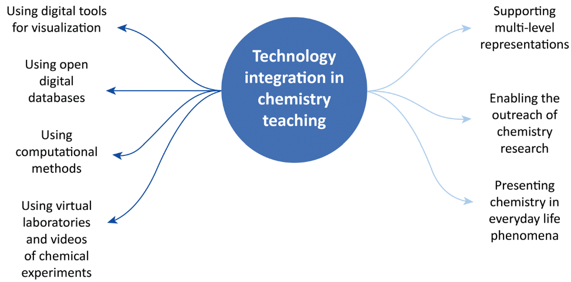

The rise of digital technologies since the second half of the 20th century has transformed every aspect of our lives and has had an ongoing effect even on one of the most conservative fields, education, including chemistry education. During the Covid-19 pandemic, chemistry teachers around the world were forced to teach remotely. This situation provided the authors with an opportunity to investigate how chemistry teachers integrate technology into their teaching, compared with how the research literature suggests that it is done. The theoretical framework used in this explorative qualitative study involves chemistry teachers&rsquo; technological, pedagogical, and content knowledge (TPACK). In particular, the study focused on different modes of technology integration (MOTIs) in chemistry teaching, which is a part of the teachers’ TPACK. In the first stage, five expert chemistry teachers were interviewed so that they could share their extensive experience with technology during online chemistry teaching. Analysis of their interviews revealed that the teachers applied 7 MOTIs in their chemistry teaching. Of these MOTIs, 4 were reported in the chemistry teaching literature: (1) using digital tools for visualization, (2) using open digital databases, (3) using computational methods, and (4) using virtual laboratories and videos of chemical experiments. In addition, the interviews revealed three new MOTIs in chemistry teaching not previously reported: (5) supporting multi-level representations, (6) enabling outreach of chemistry research, and (7) presenting chemistry in everyday life phenomena. In the second research stage, we collected the perspectives of other chemistry teachers (N = 22) regarding the 7 MOTIs. This stage enabled us to validate the findings of the first stage on a wider population and provided data to rate the importance of the seven different MOTIs according to the teachers. We wish to stress that understanding the MOTIs will not only enrich teachers’ theoretical knowledge base regarding integrating technology into chemistry teaching&#x2014;it will also contribute to chemistry teachers&rsquo; preparation and professional development programs.

# Reference

Aroch, Katchevich, and Blonder, Chem. Educ. Res. Pract., 2024, [doi:10.1039/D3RP00307H](http://dx.doi.org/10.1039/D3RP00307H)

