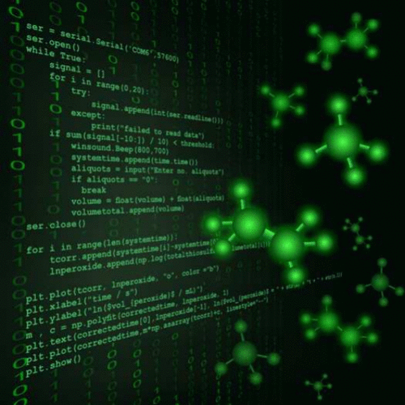

Programming is a key transferable skill within the chemical sciences with applications supporting data acquisition, as a tool for chemical and spectroscopic analysis and as an environment for theoretical modeling. Of the many available programming languages, Python stands out due to its broad functionality and open-source structure. However, introducing any programming training to an undergraduate chemistry curriculum can be challenging due to students’ lack of previous experience and limited time in pre-existing curricula for dedicated training. Here, we present a modular approach to introducing undergraduate students to Python programming through a series of taught undergraduate physical chemistry laboratory experiments. Students are first provided with a carefully scaffolded approach to basic Python syntax before enhancing the student skill set through context-based learning integrated with practical chemistry challenges. In this way, we demonstrate how a modularly integrated approach can provide a complete introduction to Python programming regardless of previous experience and without needing dedicated training time.

# Reference

D. J. Hughes, S. C. Perry, J. Chem. Educ., 2025,  [doi.org/10.1021/acs.jchemed.5c00677](https://doi.org/10.1021/acs.jchemed.5c00677)

