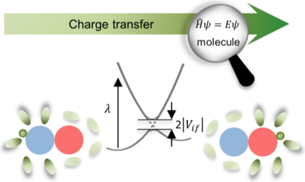

Charge transfer (CT) is a fundamental process in various chemical systems, and its kinetics, depicted by Marcus theory, is one of the central parts of chemistry education. While the practical demonstration of charge transfer mechanisms and kinetics in laboratories can be challenging, the microscopic origins of such processes are even more complex to observe. We introduce an ab initio quantum chemistry computation practice to unravel the intricacies of CT at the molecular scale. Using the “Koopmans’ theorem–energy splitting in dimer” (KT-ESD) method and the 4-point method, the electronic coupling and reorganization energy (ROE) have been obtained in series of model molecules. Through the analysis of the electronic coupling and ROE, we discern the pivotal factors of molecular structure impacting charge transfer rates. Particularly, the results from this practice align with cutting edge experimental measurements from single-molecule conducting and photoelectron spectroscopy. This computational lab module provides a valuable instrument for comprehending charge transfer rates, thereby fostering enhanced learning experiences across major chemistry courses such as kinetics, physical chemistry, quantum chemistry, and organic chemistry.

# Reference

Yacong Fan, Jing Du, Wentao Zhao, Xiaofei Ma, and Xi Yu, *Journal of Chemical Education*, Article ASAP
[DOI: 10.1021/acs.jchemed.4c00286](https://doi.org/10.1021/acs.jchemed.4c00286)

