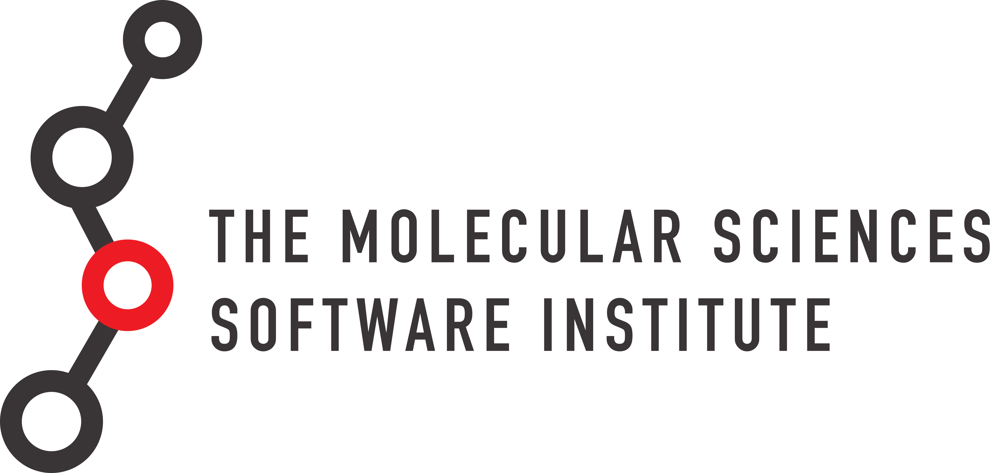

MolSSI offers 1-2 day workshops as well as online tutorial materials. All tutorials are hosted on GitHub in the [MolSSI Education organization](https://github.com/MolSSI-Education). Workshops and materials here may still be under development. Outside contribution is welcomed and encouraged!

Tutorials and materials related to workshops:

-   Python Data and Scripting
-   Data Analysis using Python
-   Parallel Programming

# Reference

Maintainers: Jessica A. Nash (janash@vt.edu, GitHub: janash), Ashley Ringer McDonald

<http://education.molssi.org/>

