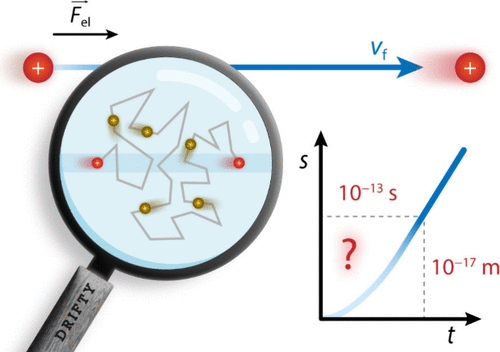

The estimation of physical quantities related to the migration of ions and colloid particles in solution under the influence of an electric field is proposed to be introduced in the undergraduate physical chemistry courses, as well as higher level courses comprising physical electrochemistry. The time required for different charged species (ions, micelles, solid colloid particles) to reach the terminal, drift velocity, and the distance the species moves in that time are estimated in a simple way based on the macroscopic point of view. A relationship between these quantities and some conductance phenomena is pointed out. The macroscopic and microscopic views on the motion of ions in solution are compared and discussed. It is clearly shown that a macroscopic approach cannot be applied to the motion of ions on the microscopic level and can lead to senseless results. A strategy based on calculating and discussing the mentioned quantities, as well as visualization of ionic motion by an appropriate simulation, is suggested to be applied in teaching of conductivity of electrolyte solutions and transport phenomena in general. The implementation of the proposed topic in teaching process, students’ learning activities, and achieved outcomes are outlined as well.

# Reference

Andrea Usenik, Nikola Kallay, Vladislav Tomišić, *J. Chem. Educ.* ASAP 2024, [doi:10.1021/acs.jchemed.4c00365](https://doi.org/10.1021/acs.jchemed.4c00365)

