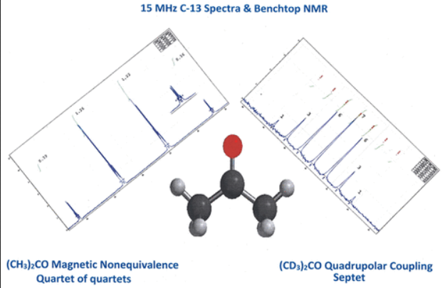

As an introduction to quadrupolar effects in NMR spectroscopy, students use low field (&nbsp;1H, 60 MHz), benchtop &nbsp;13C NMR spectroscopy to contrast the spin–spin coupling behavior of &nbsp;13C to the dipolar &nbsp;1H and quadrupolar 2D in familiar solvents C(H/D)Cl3, C(H/D)2Cl2, and (C(H/D)3)2CO. To explain the observations, students are introduced to the spin magnetic quantum number, I, and its use in predicting first order coupling patterns. To explain the multiplets, both the number of lines and the relative intensities, students must expand their understanding of coupling beyond the mnemonics “n + 1” and Pascal’s triangle for binomial expansion and instead utilize the nuclear spin magnetic quantum number, I, for the quadrupolar nucleus 2D. The exercise is a useful prelude to the introduction of NMR spectroscopy involving quadrupolar nuclei (e.g., &nbsp;14N (I = 1); &nbsp;11B (I = 3/2)) in upper-level inorganic chemistry courses or as a fundamental description of coupling in physical chemistry courses. An advantage of the low field spectrum (&nbsp;13C, 15 MHz) is the observation of magnetic nonequivalence of the two methyl groups in (CH3)2CO in which the  &nbsp;13C resonance for the methyl group is readily observed as a quartet of quartets.

# Reference

T. Leon Venable, Journal of Chemical Education,
[DOI: 10.1021/acs.jchemed.3c01291](https://doi.org/10.1021/acs.jchemed.3c01291)

