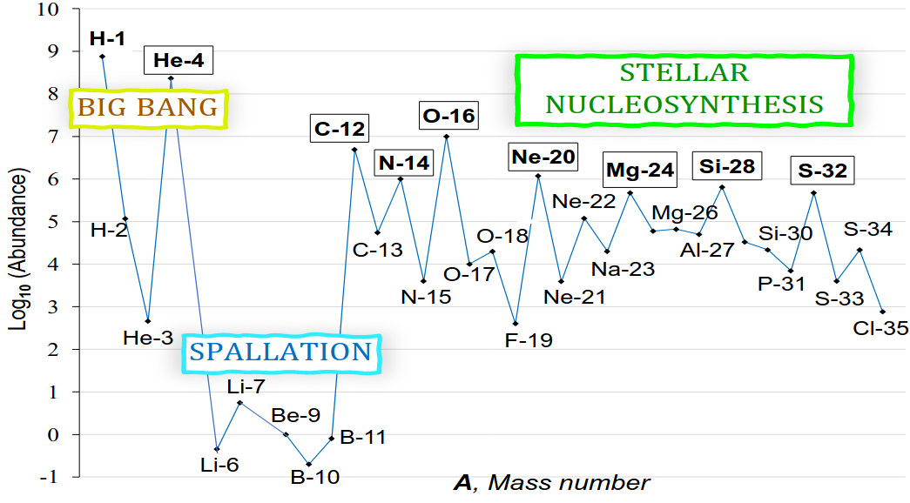

The most abundant nuclides in the cosmos have equal numbers of protons and neutrons. These include He-4, C-12, N-14, O-16, Ne-20, Mg-24, Si-28, and S-32, which together comprise 99.5% of ordinary polynucleonic matter. These are the most kinetically resilient (stable) nuclides within the highly exothermic reaction conditions of cosmic nucleosynthesis. This paper analyzes the relationship between a nuclide’s equinucleonic (Z=N) composition and its relative cosmic abundance. Structural symmetry emerges as a sensitive and specific predictor of superabundance within a proposed alternating nucleon model. The model derives from the proton’s radius (r =  0.8414 fm), the hadron’s prolate shape (from the transition to the proton’s first excited state, the ∆+(1232) resonance), and the separation distance between a pair of bound nucleons (≈ 0.8 fm, from the nucleon-nucleon potential). Various nucleon geometries were considered for each nuclide, with preference given to structures having optimal numbers of stable proton-neutron short-range interactions and whose model radii (derived from the regular polygon radius formula) best correlate with experimental charge radii (r(31)=.98, p<.001). Remarkably, the best-fit solutions for the eight superabundant Z=N nuclides categorically demonstrate bilateral structural symmetry, in which neutrons reflect protons on opposite sides of a bisecting chiral plane. Conversely, when an element’s stable isotopes are compared, the best-fit structures in which nucleon symmetry is not possible (generally because proton and neutron numbers are unequal) are less abundant by ≈ 2 orders of magnitude. Symmetry is ubiquitous in nature, and the proposed alternating nucleon model is consistent with the axiom that structural symmetry confers structural stability.

# Reference

Walsh R., ChemRxiv. 2024; [doi:10.26434/chemrxiv-2024-2mrns](https://doi.org/10.26434/chemrxiv-2024-2mrns)

This content is a preprint and has not been peer-reviewed.

