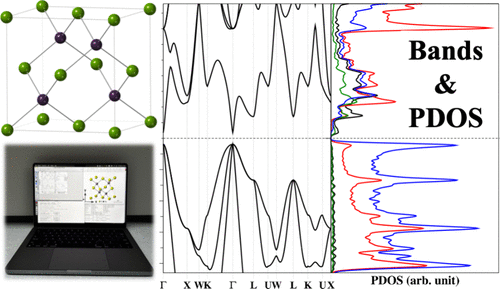

Computational materials chemistry is an ever-evolving interdisciplinary field where advancements in research capabilities require equally innovative pedagogy that combines learning, content distribution, and access. One area that bridges classroom and laboratory settings with practical hands-on learning is the use of open-source density functional theory (DFT) calculations of electronic band structures. Here, we describe to a general audience the methodology, workflow, and tutorials we have developed over five years to train student researchers. Specifically, these tutorials are for semiconductors and oxides introduced in beginner level courses which are then discussed again at various points later on in the chemistry curriculum. We provide a general overview of the background necessary to combine solid-state chemistry and electronic structure methods for instructors and DFT beginners. The remainder of the tutorial emphasizes structure–property relationships to enhance conceptual learning and make connections across the chemistry curriculum. Complete workflows for computing the electronic structure of semiconductor solids common to undergraduate and graduate chemistry curricula are presented, along with new resources for teaching computational materials chemistry. This tutorial provides multiple sets of input files and a step-by-step visualization guide to calculate band structures and projected density of states (PDOS), along with detailed descriptions that can be used to guide classroom discussions and enhance computational skills. This interdisciplinary tutorial aims to lower the barrier to entry for teachers, students, and researchers new to the field by outlining both the workflow, use, outcomes and assessments possible with freely available resources.

# Reference

Mona Layegh, Joseph W. Bennett, J. Chem. Educ., 2025, [doi.org/10.1021/acs.jchemed.4c01442](https://doi.org/10.1021/acs.jchemed.4c01442)

