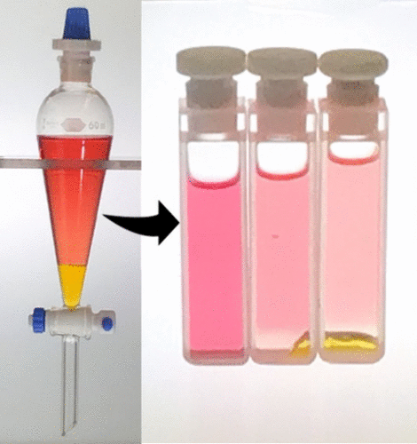

The partitioning of a chemical between two immiscible solvents can be performed in a stoppered cuvette. Since the sample remains intact during the spectroscopic analysis, it can be subjected to additional extraction solvent, so further data can be obtained. This technique has the potential to save time and money and can dramatically minimize chemical waste. The mathematics of successive partitioning are developed, so that the spectral absorption can be written as a function of the volume of the extracting solvent, and the distribution equilibrium constant *KD* can be determined by least-squares. The solvatochromic dye Brooker’s merocyanine and methylene blue were partitioned between octanol and water in a cuvette; the data yielded reasonable fits; the values of *KD* were 0.026 and 0.054, respectively. The technique was applied to the acid–base indicator methyl orange; while the data is reproducible, the fit of the data indicates some systematic bias, presumably because additional acid–base equilibria come into play.

# Reference

Carl Salter, Rebecca Skibo, Alexandra E. McDevitt, Rachel Riley, *J. Chem. Educ.*, 2025, [doi: 10.1021/acs.jchemed.4c01118](https://doi.org/10.1021/acs.jchemed.4c01118)

