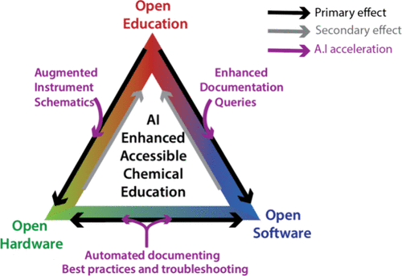

Proficiency in physical chemistry requires a broad skill set. Successful trainees often receive mentoring from senior colleagues (research advisors, postdocs, etc.). Mentoring introduces trainees to experimental design, instrumental setup, and complex data interpretation. In lab settings, trainees typically learn by customizing experimental setups, and developing new ways of analyzing data. Learning alongside experts strengthens these fundamentals, and places a focus on the clear communication of research problems. However, this level of input is not scalable, nor can it easily be shared with all researchers or students, particularly those that face socioeconomic barriers to accessing mentoring. New approaches to training will therefore progress the field of physical chemistry. Technology is disrupting and democratising scientific education and research. The emergence of free online courses and video resources enables students to learn in a style that suits them. Higher degrees of automation remove cumbersome and sometimes arbitrary technical barriers to learning new techniques, allowing one to collect high quality data quickly. Open sourcing of data and analysis tools has increased transparency, lowered barriers to access, and accelerated scientific dissemination. However, these advances also can lead to “black box” approaches to acquiring and analyzing data, where convenience replaces understanding and errors and misrepresentations become more common. The risk is a breakdown in education: *if one does not understand the fundamentals of a technique or analysis, it is difficult to correctly discern the practical limits of an experiment, distinguish signal from noise, troubleshoot problems, or take full advantage of powerful analytical procedures*. Our vision of the future of physical chemistry is built around democratized learning, where deep technical and analytical expertise from physical chemists is made freely available. Advancements in technical education through expert-generated educational resources and AI-based tools will enrich physical chemistry education. A holistic approach to education will prepare the physical chemists of 2050 to adapt to rapidly advancing technological tools, which accelerate the pace of research. Technical education will be enhanced by accessible open-source instrumentation and analysis procedures, which will provide instruments and analysis scripts specifically designed for education. High quality, comparable data from standardized open-source instruments will feed into accessible databases and analysis projects, providing others the opportunity to store and analyze both failed and successful experiments. The coupling of open-source education, hardware, and analysis will democratize physical chemistry while addressing risks associated with “black box” approaches.

# Reference

Jeffrey T. DuBose, Soren. B Scott, and Benjamin Moss, *ACS Physical Chemistry Au*, 2024, <https://doi.org/10.1021/acsphyschemau.3c00078>

