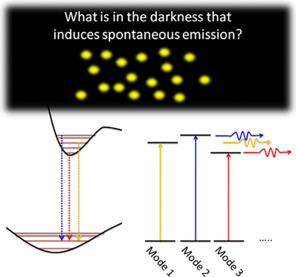

This article provides teaching material on classical and quantum electromagnetic field theory for undergraduate and graduate chemistry students. It focuses on the concepts of spontaneous emission and the photon as explained by quantum electromagnetic field theory. In general chemistry classrooms, these concepts are introduced early on using the well-known Jablonski diagram. However, we argue that the current approach to teaching spontaneous emission and the photon in chemistry needs to be re-evaluated in light of insights from quantum electromagnetic field theory. This article presents a revised proposal for teaching these topics.

# Reference

Atanu Bhattacharya, Elliot R. Bernstein, Gurazada Ravi Kumar, Arpan Chakraborty, Jayatirtha Mangalvedekar, Jayanta Ghosh, Moulinath Roy, *J. Chem. Educ.*, 2025, [doi.org/10.1021/acs.jchemed.4c01030](https://doi.org/10.1021/acs.jchemed.4c01030)

