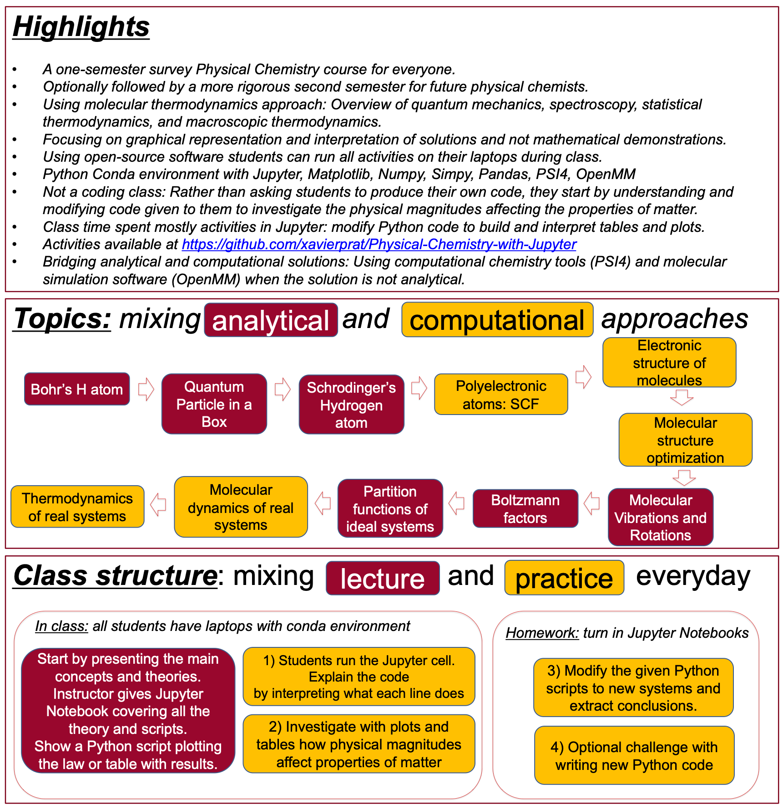

A physical chemistry course with active learning strategies using python and jupyter notebooks. Classroom activities include

-   Bohr&rsquo;s atom
-   The particle in a box
-   Schrodinger&rsquo;s hydrogen atom
-   Polyelectronic atoms using psi4
-   Electronic, vibrational, and rotational levels of molecules
-   Boltzmann factor, partition functions, and thermodynamic properties
-   Introduction to molecular mechanics

# Reference

<https://github.com/xavierprat/Physical-Chemistry-with-Jupyter>

<http://umn.edu/home/pratr001>

