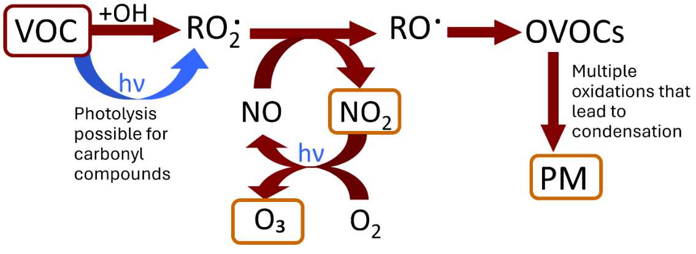

Including practical atmospheric chemistry in the undergraduate syllabus presents numerous challenges: most research grade equipment is too complex and expensive, and can require extensive safety training for students to use independently and efficiently. Herein we report an undergraduate analytical project that can be effectively performed in teaching laboratories equipped with standard UV-vis spectrometers, centered around an important application of photochemical kinetics in atmospheric research. Carbonyl compounds in cyclohexane can be considered to be “quasi-gas-phase”; therefore, measurements of their absorption spectra can provide useful information into the compound’s atmospheric photochemistry – a critically understudied aspect of atmospheric kinetics. We have delivered this course for two years and found that a project centered around collecting, processing, and understanding the atmospheric implications of these spectra is accessible to a range of student abilities and is an excellent tool for introducing the wider concepts and impacts of atmospheric chemistry.

# Reference

1.  D’Souza Metcalf J., Winkless R., Smith S. C., Rickard A. R., Dillon T. J.,  ChemRxiv. 2025; [doi:10.26434/chemrxiv-2025-l5rgh-v2](https://doi.org/10.26434/chemrxiv-2025-l5rgh-v2)  
    This content is a preprint and has not been peer-reviewed.

