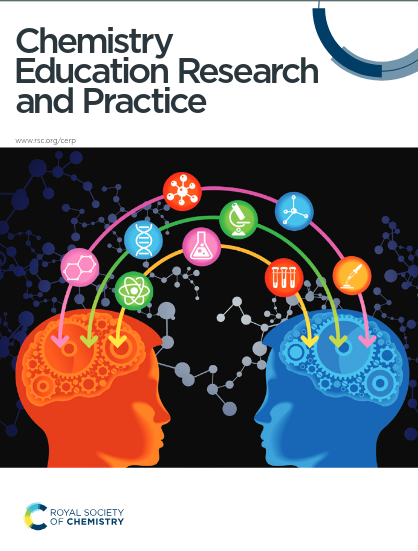

Critical thinking (CT) is actively reflecting upon one’s experience and knowledge while searching for necessary information through inquiry, representing a fundamental competency in science education. Transitioning science teaching from passive rote learning to emphasizing CT skills is essential for promoting inquiry-based learning and scientific argumentation. However, fostering and assessing CT within scientific inquiry and laboratory-based learning environments continues to present significant challenges. This study examined the impact of a modified laboratory manual (LM) integrating cognitive prompts designed to enhance CT skills and dispositions in an undergraduate physical chemistry laboratory course. Using a mixed methods approach with pre- and post-experimental design, we assessed CT outcomes with the California Critical Thinking Disposition Inventory (CCTDI) and the California Critical Thinking Skills Test (CCTST), supplemented by open-ended questionnaires and semi-structured interviews with both teaching staff and students to evaluate perceptions of the intervention. Participants included 31 second-year undergraduate students randomly assigned to either an experimental group (n=11) that used the CT-focused modified LM or a control group (n=20) that followed the traditional LM. Results showed no observable differences between groups in the CCTST tool. However, a statistically significant decrease was observed in the control group’s CT dispositions, in the overall score of the CCTDI, and four of seven subscales, while the experimental group maintained their CT dispositions. The four affected subscales were specifically aligned with the modifications’ objectives, while the remaining three were unrelated to the original LM and course objectives. Qualitative findings from interviews corroborated these results, indicating that the targeted modifications effectively sustained and enhanced CT dispositions in undergraduate laboratory settings. The study highlights the importance of incorporating CT through structured learning activities in undergraduate science education to maintain student engagement and CT dispositions, while promoting higher-order thinking skills.

# Reference

L. Danial, J. Koenen and R. Tiemann, Chem. Educ. Res. Pract., 2025, [DOI: 10.1039/D4RP00373J](https://doi.org/10.1039/D4RP00373J).

