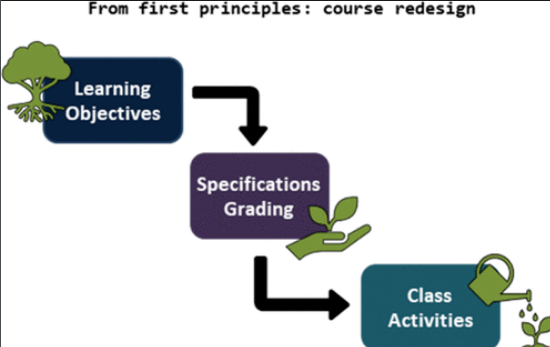

A one-semester physical chemistry course was fully redesigned with a modular structure to incorporate a specifications grading system. The motivation for the redesign is discussed, and the revised course structure is described. This course is taught once a year, and lessons learned from five implementations are highlighted (Fall semesters 2018–2022). Most of the course offerings were in-person, except for the virtual Fall 2020 iteration. Although there was no significant difference in final grades found before and after the redesign, the updated course permitted more consistent coverage of topics across the focus areas (thermodynamics, quantum mechanics, kinetics, and spectroscopy). Further, course evaluation comments revealed that students were initially hesitant to embrace the specifications grading scheme, but many embraced it as the semester progressed and appreciated the emphasis on understanding the material. From an instructor perspective, careful design of the revision and retake system keeps the workload manageable. Overall, the course redesign ensured coverage of a full spectrum of the physical chemistry curriculum, and students were able to focus on learning the material rather than earning a set number of points.

# Reference

Closser, Kristina D. and Hawker, Morgan J. and Muchalski, Hubert, *J. Chem. Educ.* 101 (2), 2024, 474-482, [DOI: 10.1021/acs.jchemed.3c00872](https://doi.org/10.1021/acs.jchemed.3c00872)

