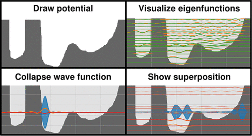

We present a tool, one that is both a stand-alone web-based video game and a Python package, designed for students to explore a particle’s wave function on one-dimensional potential surfaces. The tool relies on a basis set formalism and can, therefore, explore any one-dimensional potential surface imaginable. This tool also lets students interact with the wave function and is the first of its kind to explore concepts such as the superposition principle and wave function collapse; its time-dependent nature shows how any wave function evolves over time, allowing for exploration of other concepts such as the uncertainty principle. The video game’s ease of use makes these concepts accessible to anyone, without prior chemistry or programming background─though we expect that it would be most useful for undergraduate physical chemistry students and instructors. Preliminary use of QPiaS in a physical chemistry undergraduate course shows encouraging feedback regarding advancements in learning outcomes.

# Reference

Chulhai D. Quantum Particle-in-a-Sandbox: A video game that explores the time-dependent wave function for any arbitrary one-dimensional potential. ChemRxiv. 2023; [doi:10.26434/chemrxiv-2022-7fkzw-v3](https://doi.org/10.26434/chemrxiv-2022-7fkzw-v3) This content is a preprint and has not been peer-reviewed.

Dhabih V. Chulhai, Journal of Chemical Education Article ASAP, [doi:10.1021/acs.jchemed.3c00774](https://doi.org/10.1021/acs.jchemed.3c00774) 

QPIAS web-based game: <https://chulhai.itch.io/qpias>

Python source: <https://github.com/dchulhai/QPiaS>

