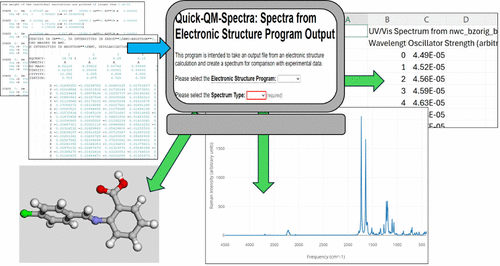

The Quick Quantum Mechanical Spectra (Quick-QM-Spectra or QQMS) website has been developed as an easily accessible way for students (and others) to obtain spectral images and comma-separated values (CSV) files from the text output files of common open-source electronic structure programs. Unlike many of the highly powerful, yet more complicated visualization programs available, the QQMS website requires no software download (other than a standard Internet browser) or significant learning curve for anyone to use. IR, UV/vis, and Raman spectra can be obtained within seconds simply by uploading GAMESS, NWChem, and ORCA output to the QQMS website. IR and UV/vis spectra can also be obtained from a Psi4 output. The QQMS website is intended to be a simple time-saving tool that enables students (and others) to focus their effort on the analysis, not the generation, of theoretical spectra.

# Reference

<https://hanlev.github.io/QQMS/>

<https://github.com/hanlev/QQMS>

Hannah R. Leverentz-Culp, Joseph K. West, *J. Chem. Educ.*, 2025, [doi.org/10.1021/acs.jchemed.4c01547](https://doi.org/10.1021/acs.jchemed.4c01547)

