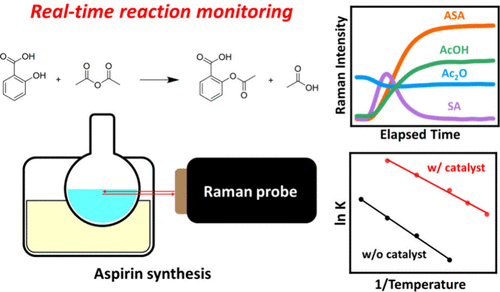

Reaction kinetics is a keystone concept in physical chemistry experiments, yet students often struggle with it in the laboratory because they inevitably need to measure the concentration changes over time using only a limited set of instruments. Raman spectroscopy, with its capabilities of nondestructive molecular fingerprinting and inherent multicomponent analysis, overcomes this limitation by allowing several analytes to be monitored simultaneously. Here we have selected the classic aspirin synthesis experiment, widely used in general and organic chemistry laboratories, for real time kinetic analysis by Raman spectroscopy. Instead of merely calculating the synthesis yield, students correlated the characteristic Raman intensities of salicylic acid, acetic anhydride, acetyl salicylic acid, and acetic acid with their concentrations to generate continuous concentration profiles with time. By varying experimental conditions, such as temperature and catalytic sulfuric acid, they could observe the corresponding immediate effects on the reaction rate. Fitting the time dependent Raman signals to a pseudo-first-order kinetic model yielded reasonable rate constants, which students could compare quantitatively. Activation energies for both the catalyzed and uncatalyzed reactions were then obtained from the Arrhenius plots, confirming that the catalyst provides a different reaction pathway with a generally lower energy barrier. This experiment enables students to directly visualize the temporal evolution of a reaction while simultaneously tracking the concentration changes of multiple species. It allows them to calculate kinetic parameters to gain a deeper understanding of chemical kinetics through real time data acquisition and analysis. Importantly, students achieved higher scores on the post-test compared to the pre-test, demonstrating a positive learning effect. In addition, post-laboratory surveys indicated that students found the experiment both effective and engaging.

# Reference

Wonki Son, Doohyun Baik, Sung Gun Lee, Dae Hong Jeong, *J. Chem. Ed.*, 2026, [doi.org/10.1021/acs.jchemed.5c00754](https://doi.org/10.1021/acs.jchemed.5c00754).

