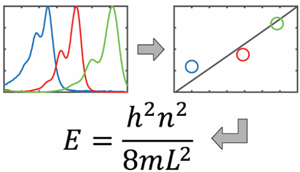

Given the growing prevalence of computational methods in chemistry, it is essential that undergraduate curricula introduce students to these approaches. One such area is the application of machine learning (ML) techniques to chemistry. Here we describe a new activity that applies ML regression analysis to the common physical chemistry laboratory experiment on the electronic absorption spectra of cyanine dyes. In the classic version of this experiment, students collect experimental spectra and interpret them using the Kuhn free electron model, based on the quantum mechanical particle-in-a-box (PIB). Our new computational activity has students train regression models of increasing complexity to predict the wavelength of maximum absorption for different cyanine dyes using a set of 13 molecular features. In addition, the activity introduces methods for evaluating and interpreting regression models. Ultimately, students are prompted to use their regression analysis results to generate hypotheses for what molecular properties underlie cyanine dye absorption, leading them naturally to the PIB model. In this report, we provide a dataset, reference code implementations in Mathematica and Python notebooks, and an example lab protocol with an introduction to cyanine dyes and the ML techniques. This activity can be completed in a single 3-hour lab period by upper-level undergraduate students with relatively little prior programming experience. Although intended to complement the experimental measurement of cyanine dye spectra, this activity can also be performed on its own; alternatively, it can form the basis of more involved projects in a computational chemistry or machine learning course.

# Reference

Thrall E, Martinez Lopez F, Egg T, Lee SE, Schrier J, Zhao
Y. Rediscovering the particle in a box: Machine learning regression
analysis for hypothesis generation in physical chemistry
lab. ChemRxiv. Cambridge: Cambridge Open Engage; 2023,
[DOI
10.26434/chemrxiv-2023-9gkk4-v2](https://doi.org/10.26434/chemrxiv-2023-9gkk4-v2)

This content is a preprint and has not been peer-reviewed.

Github repository: <https://github.com/elizabeththrall/MLforPChem/tree/main/MLcyaninedye>

KEYWORDS: Upper-Division Undergraduate, Physical Chemistry, Computer-Based Learning, Computational
Chemistry, Machine Learning, Spectroscopy, Cyanine

