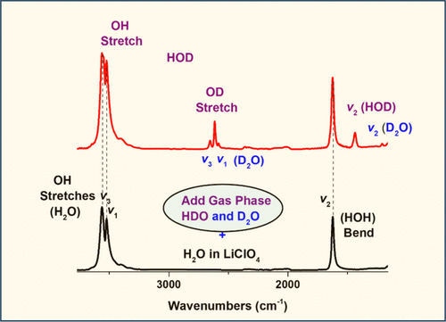

Isotope effects are widely used in infrared analyses of a range of chemical systems. Water molecules with three active modes are one of the most studied for testing the applicability of theoretical models. Whereas the IR spectrum of free gaseous water is very complex due to the accompanying rotational spectral features, the ATR-FTIR spectrum of a semidry solid LiCO4 sample reveals well-resolved 3 vibrational features of seemingly isolated molecules trapped within the solid matrix. Exposure of that sample to additional H2O vapors causes an increase in the intensity of these features, while further exposure causes them to broaden, red-shift, and intensify due to formation of H-bonding-networked water aggregates. Exposure of a different sample to D2O vapors enables the recording of new and well-resolved peaks assignable to the normal vibrational modes of HDO and D2O molecules. The position and relative intensity of these peaks can be used for testing theoretical predictions, based on coupled-oscillators model, together with the approach of force constants and geometrical factors of a bent triatomic molecule. By using the ratio of the experimentally determined positions of the antisymmetric and symmetric stretching peaks of H2O, and computing the ratio of geometric factors, one can estimate ratio of the force constants within the solid and extend it to estimate the same for D2O molecule to compare with experimental data. Extracting force constant variations is a very crucial step for tracing the chemical nature of intermolecular interactions within various systems and materials. Through repeating these simple measurements, one would not only gain a deeper understanding of several advanced concepts in IR spectroscopy and isotope effects but also learn how to simplify difficult mathematical procedures. Simple measurements outlined herein would also enable visualization of gas phase H/D exchange in real-time.

# Reference

Suleyman Ince, Sefik Suzer, *J. Chem. Educ.*, 2025, [doi.org/10.1021/acs.jchemed.5c00535](https://doi.org/10.1021/acs.jchemed.5c00535)

