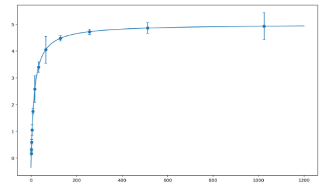
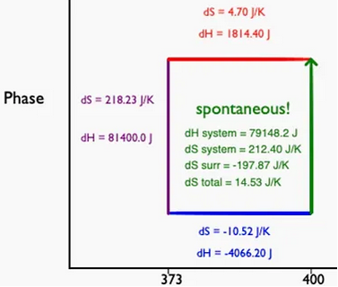
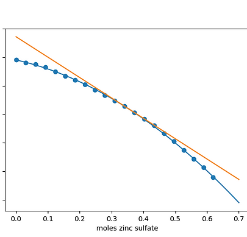

A collection of [tutorials and coding assignments](https://aschoef.wixsite.com/schoefflerlab/teaching) for teaching physical chemistry and biochemistry.

## Python for Chemists

This tutorial uses examples from chemistry to teach basic concepts in coding in python. The embedded activities are implemented in trinket, a web-based coding platform. 

## Visualizing Perfect and Real Gas Laws in Python

Visualizing gas laws is a simple &ldquo;first&rdquo; coding assignment, but can yield large learning gains by giving students the ability to &ldquo;play&rdquo; with conditions and coefficients and build intuition. The prompts walk students through building simple scripts to display isotherms based on the Perfect gas Law and the van der Waals Gas Law. It is assumed that students has already completed a python tutorial (such as Python for Chemists). The assignments are implemented in [trinket](https://trinket.io). They can be easily adapted for a Jupyter Notebook format and edited to encompass integration to determine expansion work.

## Modeling the Maxwell-Boltzmann Distribution

This project assumes students have first completed an introductory python tutorial, available here (implemented in trinket; requires a free online account). This assignment prompt first walks students through creating an account with ChemCompute, a freely-access online scientific computing environment. Subsequent steps guide students through plotting and analyzing Maxwell-Boltzmann Distributions. 

## Total Entropy of a Phase Transition

In this tutorial, students create a graphic visualizing a phase transition at a non-transition temperature.  The assignment requires students to calculate the entropy and enthalpy associated with phase transitions and temperature changes. The assignment can be implemented in [trinket](https://trinket.io) (which requires a free account).

## Assessing Mathematical Models for Temperature-Dependent Heat Capacity

This procedure walks students through writing a Python program that accepts heat capacity and temperature data and fits the data to three different mathematical models. Students are then asked to compute the residuals for each fit and evaluate which model best succeeds in explaining the experimental data from a 1939 report by the National Bureau of Standards. The tutorial is available as a PDF. 

## Calculating Partial Molar Volume

 In this project, students access data on the density of aqueous zinc sulfate solutions, available through a Chem Libretexts assignment designed by Tandy Grubbs. (Data from the CRC handbook of Chemistry and Physics, 66th edition, 1985-1986). The density data can be used to find solution volumes and moles of zinc sulfate. These data can then be plotted and fit to a polynomial, and student can use sympy to integrate the fitting function and thus calculate the partial molar volume at a given molality of zinc sulfate. The exercise further prompts students to plot a tangent line at a user-selected molality. The project assumes that students have already completed a nonlinear fitting project in python, such as through the Temperature-Dependent Heat Capacity project or the Michaelis-Menten Fitting Code project. This project is easily adaptable to accept experimental data from an undergraduate laboratory exercise. 

## Michaelis-Menten Fitting

This procedure walks students through writing a Python program that accepts enzyme activity data (substrate concentrations and associated velocities), fits the data to the Michaelis-Menten equation, and outputs a figure of the fit. The Michaelis-Menten Fitting Code Project tutorial comes in two parts: 1) Students access a set of Jupyter Notebooks (available through GitHub) to walk through concepts in Michaelis-Menten kinetics; 2) Students write their own fitting code based on a PDF handout. The tutorial is set up to work in ChemCompute, a free, online scientific computing environment

# Reference

Allyn Scheoffler,  Department of Chemistry & Biochemistry, Loyola University New Orleans

[https://aschoef.wixsite.com/schoefflerlab/teaching](https://aschoef.wixsite.com/schoefflerlab/teaching)

