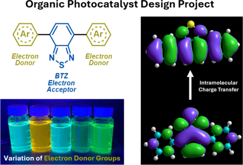

An advanced chemistry laboratory project has been developed to introduce final year undergraduate students to organic photocatalyst design using benzo[c][1,2,5]thiadiazole (BTZ) photocatalysts, prepared via a single Suzuki-Miyaura cross-coupling from cheap starting materials, as the example. This project took on a research lab style structure, and over the course of 6 weeks students were tasked to (1) synthesize and study the photophysical properties of three BTZ-based photocatalysts; (2) apply the BTZ photocatalysts to a test photoredox reaction using cheap home-built LEDs, and (3) perform rudimentary computational calculations to rationalize key experimental results.

# Reference

Dominic Taylor, Leonardo Amicosante, Luize M. Luse, Martin R. S. McCoustra, Lee McMahon, Scott J. Dalgarno, Filipe Vilela, *J. Chem. Ed.*, 2025, [doi.org/10.1021/acs.jchemed.4c01241](https://doi.org/10.1021/acs.jchemed.4c01241)

