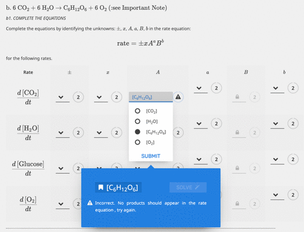

Smart Worksheets were introduced in 2017 into a second-year undergraduate chemical kinetics course (UK) and were available to students from the start of the course until the summer examination (ca. 3 months in duration). Several metrics strongly suggest that the introduction of the Smart Worksheets has a very positive impact on student understanding. For example, students who attended workshops completed twice as many questions as in previous years, with some completing them all. Students who attended workshops were much better prepared for these workshop activities, and because students had used the Smart Worksheets before the workshops, the tutor had information on what students understood and did not understand. Therefore, workshop tutors were able to prepare workshops that targeted specific needs. Questions asked in workshops and in an online forum showed more higher-order thinking than in previous years. Student feedback highlighted the usefulness of the Smart Worksheets (e.g., the instant feedback), and examination scores showed a statistically significant difference (95% confidence level) between the mean score for those who used the Smart Worksheets (larger than) compared with those who did not. This study suggests that Smart Worksheets can have a significant positive impact on student cognition, assessment (here examination) performance, enjoyment, and enthusiasm for a highly quantitative course.

# Reference

Dudley E. Shallcross, Michael T. Davies-Coleman, Chris Lloyd, Bill Heslop, John Eastman, Tony Baldwin, Iain Thistlethwaite, and Sophie D. Franklin,
*Journal of Chem. Educ.*, 2024, 101 (4), 1735-1740, [10.1021/acs.jchemed.3c00934](https://doi.org/10.1021/acs.jchemed.3c00934)

