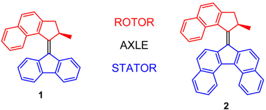

Hückel theory is an empirical quantum chemical method that allows
students to solve the secular equations using pen-and-paper. Usually
simple hydrocarbons are considered for this exercise, which might not
be that inspiring to students. In this work, we present basic Python
code to solve this eigenvalue problem and apply it successfully to
molecular motors. It is demonstrated that Hückel theory can
qualitatively predict the red-shifting of the excitation wavelength
upon substituting the aromatic core of a molecular motor. The Hückel
calculated frontier molecular orbitals agree well with density
functional theory.

# Reference

Heinen J. Solving secular equations for molecular motors within the Hückel approximation using Python. ChemRxiv. Cambridge: Cambridge Open Engage; 2023; This content is a preprint and has not been peer-reviewed.

[doi.org/10.26434/chemrxiv-2023-gf0zv](https://doi.org/10.26434/chemrxiv-2023-gf0zv)

KEYWORDS:

