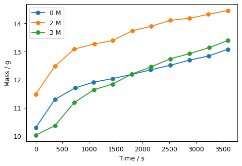

You are making a meal and the recipe you are using calls for canned chickpea, but you do not have a can of chickpeas. While searching your kitchen, you find a bag of dried chickpeas. Can you use the dried chickpeas instead of the canned chickpeas? Should you go back to the store just to buy a can of chickpeas, or can you soak the chickpeas you already have? Will the meal be ready in time?

The first phase (Experiment Part One) is an exploratory phase in which students become accustomed to the system of hydrating chickpeas by conducting some initial investigations. Experiment Part One can be completed in a single three-hour lab session if the students are given the salt solutions already made. If students have to prepare the solutions the instructor might need some additional class time to discuss the final results of the first session.

The second phase (Experiment Part Two) focuses on modeling hydration and should begin towards the end of the first session of activity. The data for this long term soaking will be collected during session two. Analysis of the suitability of Peleg’s equation can be done using EXCEL or other spreadsheet programs (plot.ly is available for free).

A third phase (which is optional, but highly encouraged) involves students selecting some aspect of bean hydration and developing their own investigations on it. For these additional investigations, the class may decide to all focus on the same topic. Alternately, each group of students may decide to pursue unique projects.

The basic version of this experiment is expected to take two three-hour lab periods. A more complete version would require three periods.

## Learning objectives

### Content Objectives

Students will be able to:

-   determine the initial rate for a process given raw data (mass of
    chickpeas) as a function of time.
-   recognize that the rate is not constant and can provide explanations
    as to why the rate of hydration must slow down and provide an
    estimate of what the rate will be at very long times.
-   explain, using the concept of osmosis, how the concentration of salt
    in the water affects the rate of hydration (optional).
-   select additional factors that might influence the rate of hydration
    for further study during the final part of the experiment.

### Process Objectives

Students will be able to

-   model the rate of hydration of the chickpeas using the Peleg equation.
-   explain how to relate the parameters in the Peleg equation to their data.
-   develop a simple model for the surface of the chickpea as a semipermeable
    membrane.
-   design an experimental procedure to study other factors affecting
    the rate of hydration

# Reference

Lead Author: Maria Pacheco

[View student version](https://chemistry.coe.edu/piper/pclform.html?expt=chickpeas)

The Instructor’s Handbook with implementation details, sample data, and expected answers is available through the [POGIL-PCL project](https://www.pogilpcl.org/get-connected). 

