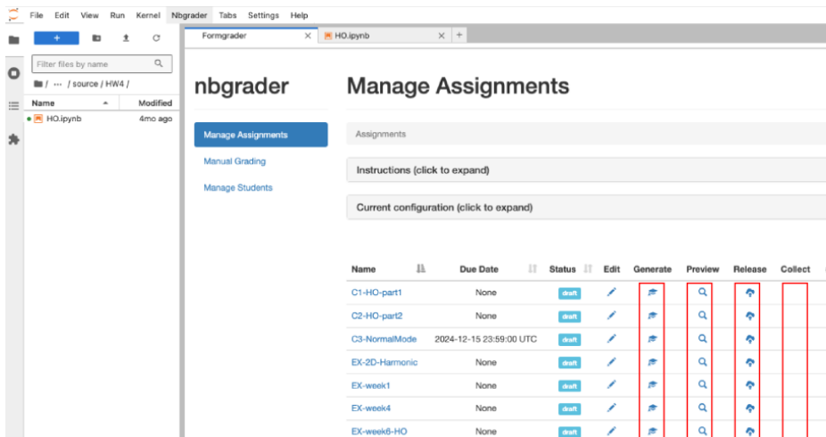

Integrating coding skills into chemistry education is crucial for preparing students to meet the demands of modern research. However, the technical challenges associated with installing computational tools often discourage chemistry educators from incorporating programming exercises into their courses. To tackle these challenges, we developed a preconfigured image on Jetstream 2, a cloud computing environment using OpenStack infrastructure. This image, shared with the community, allows chemistry instructors to effortlessly deploy a JupyterHub platform for their classrooms, facilitating the teaching of programming skills. Integrated with the automatic grading package nbgrader, the JupyterHub website created from this image enables seamless assignment creation, distribution, and automatic grading on a cloud-based platform. Students can access assignments directly through their web browsers without the need to install software or configure their local machines. This tool empowers educators to equip future scientists with essential coding skills, enabling them to tackle interdisciplinary challenges and drive chemical discoveries forward.

# Reference

Dong L, Liu F. Streamlining Coding Assignments and Grading on the Cloud: A Preconfigured JupyterHub Image for Chemistry Education. ChemRxiv. 2025; [doi.org/10.26434/chemrxiv-2025-07k5s](https://doi.org/10.26434/chemrxiv-2025-07k5s)

This content is a preprint and has not been peer-reviewed.

