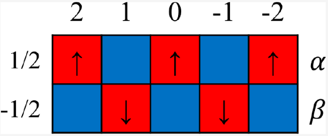

In this paper, we propose a novel method for deriving Russell-Saunders terms of complex atomic systems with an arbitrary number of equivalent electrons in orbitals with a higher azimuthal number. The method can be regarded as an extension of the classic works of Douglas, McDaniel, and Hyde but with several notable improvements, including the introduction of symmetry and spin string, that simplify the enumeration process. Moreover, the method is simple for undergraduate students’&rsquo;apprehension, requiring only basic knowledge of combinatorial mathematics at the high-school level. Last but not least, it reduces the computational cost for complex systems, which is illustrated not only by the paradigmatic example of the $nd^4$ configuration in the text but also by two other much more complicated examples of nfm and ngm. Considering both the simplicity and efficiency of the new method, we expect that it would be generally applicable to the teaching practice of the derivation of Russell−Saunders terms in advanced physical chemistry courses.

# Reference

Huizhu Zhang and Zhenhua Chen, Journal of Chemical Education Article ASAP,
[DOI: 10.1021/acs.jchemed.2c01109](https://doi.org/10.1021/acs.jchemed.2c01109)

KEYWORDS: Atomic Terms, Microstate, Symmetry, Particle-Hole Symmetry, Quantum Chemistry, Upper-Division Undergraduate 

