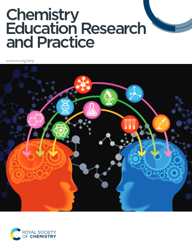

A flipped classroom is typically one where some of the instruction occurs asynchronously prior to the scheduled synchronous meeting between students and the instructor. Since 2000, they have gained substantial popularity especially in STEM fields where they have been shown to have increased exam scores and reduce the number of students who fail. In the university setting, many of these studies have been performed in lower division courses. Very few studies have been conducted in senior physical chemistry courses resulting in very little data being collected on this instructional technique at this level. The purpose of this study is to assess student outcomes when flipped classroom techniques are implemented in a senior physical chemistry course. In our flipped classroom, students were expected to watch lecture videos and complete preparation exercises created by the authors prior to coming to class. Then in class, a just in time teaching model was employed prior to students working in groups to complete activities created by the authors. Seven quizzes were performed individually and in groups while three midterms and a cumulative final exam were performed individually. Grade, student opinion questionnaires and survey data collected over seven semesters from Fall 2017 to Spring 2022 will be presented. Our findings indicate that there was only one semester out of seven where the average GPA of the students was significantly higher than the control class which was taught in a traditional lecture style. According to student surveys, the students focused on the importance of the preparation questions and dismissed the importance of completing activity/homework problems given that preparation activities were assigned credit while homework was not. Given that the in-class activities/homework questions resembled the material in assessments like quizzes, midterms and final exams, while preparation questions were scaffolded formative problems meant to introduce students to the concepts to be studied during the synchronous lecture, an important link between course concepts and material on summative assessments was not made. Future changes to address this issue will be discussed as well as how COVID-19 affected students during the pandemic as well as flipped classroom instruction.

# Reference

T. M. Gomez, C. Luciano, T. Nguyen, S. M. Villafane and M. N. Groves, *Chem. Educ. Res. Pract.*, 2024, [doi.org/10.1039/D4RP00074A](https://doi.org/10.1039/D4RP00074A)

