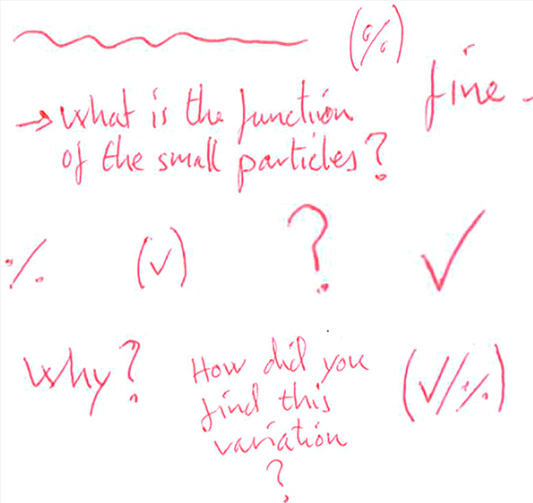

In pharmaceutical laboratory teaching and learning, students’ written reports allow them to document their understanding. Therefore, feedback on these reports is crucial for the students’ continued learning. This study investigates written feedback on laboratory reports and compares the students’ perceptions with teachers’ intentions. The study is based on interviews and student reports containing written feedback notes. Four teachers and five students were interviewed. Results show that written comments are typically brief and intend to quickly guide the students toward further action. However, students often fail to use the comments as intended. Reports are assessed as passed or not passed. Results indicate that students may disregard feedback when their report is passed, showing how a summative element in the feedback may overshadow the intended formative feedback. Teachers and students value oral dialogue in the laboratory. Based on the theory of congruence of learning environments, implications for feedback practices are discussed.

# Reference

Jonas T. Jørgensen, Bente Gammelgaard, and Frederik V. Christiansen, J. Chem. Educ. 2023, 100, 10, 3764–3773, [doi.org/10.1021/acs.jchemed.2c01148](https://doi.org/10.1021/acs.jchemed.2c01148)

