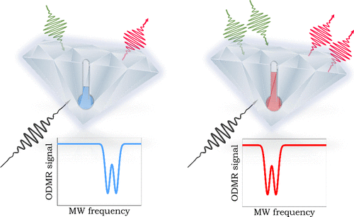

This work reports a study of thermal effects in nitrogen vacancies in diamond using the optically detected continuous wave magnetic resonance (cw-ODMR) method. Changes in the ODMR signal induced by heating the diamond sample with both laser light at various powers and by a simple heater were investigated and analyzed. The influence of heating on the ODMR signal was measured for two types of synthetic diamond powder─a low cost microcrystalline powder (particle diameters ca. 80 μm) and a high purity nanodiamond powder (particle diameters ca. 140 nm). The experimental setup can be viewed as a pedagogical quantum thermometer. A number of cost-effective components were used, e.g., a self-constructed confocal microscope, and the Raspberry Pi 4B microcomputer in an experiment control and data acquisition system, as well as an inexpensive microwave modulator, analog to digital converter, and a heating plate.

# Reference

Gustaw Szawioła, Szymon Mieloch, Danuta Stefańska Przemysław Głowacki, Agata Frajtak, Jędrzej Michalczyk, Krzysztof Murawski, Andrzej Pruchlat, Jan Raczyński, Michał Schmidt, Jerzy Sobkowski, Maksymilian Wosicki, Andrzej Biadasz, Adam Buczek, Anna Dychalska, Piotr Mazerewicz, Mirosław Szybowicz, J. Chem. Educ., 2025, [doi.org/10.1021/acs.jchemed.4c01434](https://doi.org/10.1021/acs.jchemed.4c01434)

