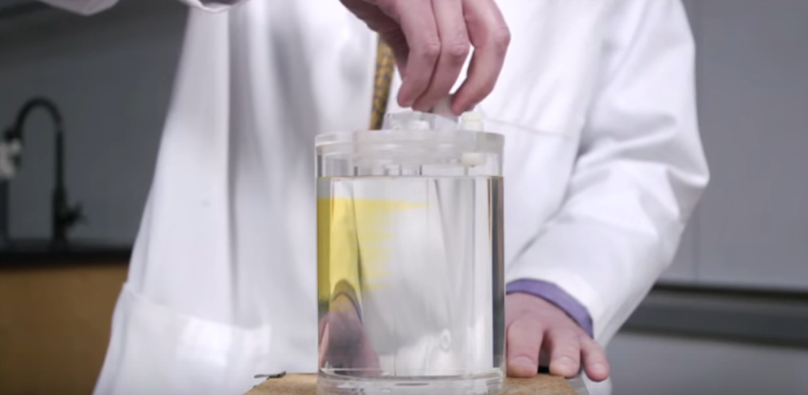

Thermodynamics demonstrations originally prepared for the Coursera MOOC: Statistical Molecular Thermodynamics. Topics include

-   The Apparent Anti-Entropy of Mixing
-   Phases of Carbon Dioxide
-   Partition of Energy in an Ideal Diatomic Gas
-   Dramatically Endo- and Exothermic Reactions
-   The Adiabatic Fire Starter Piston
-   Some Gas Laws
-   Atomic Spectra of H and He
-   Wave Mechanics with a String
-   Hydrogen Chloride Cannon
-   Liquid Oxygen
-   Burning Magnesium with Dry Ice
-   Rubber Band Thermodynamics
-   Polishing Silver the Entropic Way
-   A Stirling Engine at Work
-   A Vortex Tube at Work

[Thermodynamics Demonstrations](https://www.youtube.com/playlist?list=PLkNVwyLvX_THRhHFPc1mFeJiMMUmLYWPh)

# Author

Chris Cramer, Department of Chemistry, University of Minnesota

