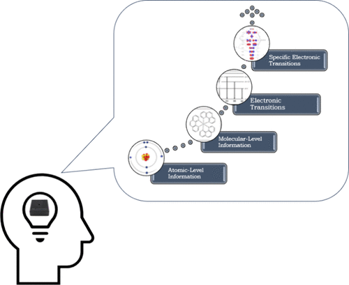

Ultraviolet–visible spectroscopy is widely used in undergraduate chemistry. Despite its ubiquitous use, very little research has been conducted on how students develop understanding or competency with this spectroscopic tool. To begin addressing this gap, we present results from an exploratory cross-sectional qualitative investigation of how postsecondary chemistry students reason about UV/vis spectroscopy. We used a phenomenographic construct modeling approach to characterize different ways learners experience the phenomenon of UV/vis spectroscopy. We have organized these various ways hierarchically according to sophistication. These levels were distinct from each other based on how students explained light interacting with molecules to give rise to spectral peaks. The lowest level reasoning showed that students link spectral peaks to individual atoms within molecules. In contrast, the highest level of understanding offered a mechanism of how light specifically interacts with molecules to give rise to spectral peaks by activating resources about specific electronic transitions. These results provide a starting point for a working model of students’ reasoning. We view this as a developmental model to show how students can progress from atom-level information to offering a mechanistic explanation of how light interacts with molecules, which can translate to other light–matter interaction-based phenomena.

# Reference

Haiyan Al Fulaiti, Amelie Cole, Morgan Balabanoff, and Alena Moon, Journal of Chemical Education Article ASAP, DOI: [10.1021/acs.jchemed.4c00120](https://doi.org/10.1021/acs.jchemed.4c00120)

