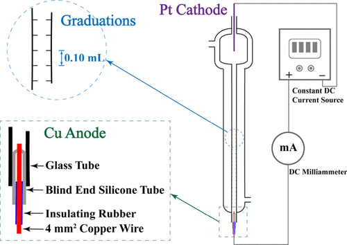

The variation in the transference number of H+ (aq) is investigated for different HCl solution concentrations. The method for scribing graduations on electromigration tubes is modified to decrease the error in experimental measurements, and metallic copper is used as the anode to reduce the toxicity and environmental impact of the reagents. For very dilute HCl solutions, the correlation between the transference number and HCl concentration is theoretically described using equations derived from the Debye–Hückel–Onsager equation for ionic molar conductivity, and Longsworth’s method is applied to extrapolate the limiting transference number from the raw data. The modified apparatus improves the measurement accuracy, and the relevant calculations are applicable to the laboratory curriculum of senior undergraduate physical chemistry. By careful observation, rigorous analysis and comprehensive data treatment, the students are led to use the knowledge in textbooks to do some creative researches.

# Reference

Meifen Wu, Yafei Liu, and Xinhua Xu, Journal of Chemical Education, 2024,
[DOI:10.1021/acs.jchemed.3c00826](https://doi.org/10.1021/acs.jchemed.3c00826)

