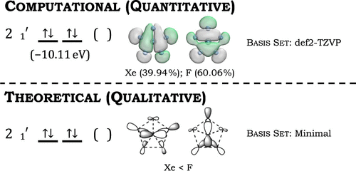

A key concept for students learning how computational chemistry calculates the electronic structure of molecules involves translating qualitative concepts like the projector operator method and the Schrödinger Equation to the quantitative methods that approximate the many-body problem. The following project is for an independent study student or an undergraduate researcher desiring training in theoretical chemistry. The C5 symmetry of the pentafluoroxenate(IV) anion showcases that &ldquo;bonds form when orbitals overlap.&rdquo; The project guides students to see how number theory is incorporated into molecular structures and the nature of shapes. Additionally, [XeF5]− has minimal d-orbital contributions, so the student does not require previous experience with d-orbital splitting. The qualitative analysis of the pentagonal planar, D5h pentafluoroxenate(IV) anion [XeF5]− was performed using group theory and the projection operator method. The computational approach used a population analysis of [XeF5]− to obtain the electronic structure.

# Reference

Kevin P. Freddo and I. F. Dempsey Hyatt, Journal of Chemical Education, DOI: [10.1021/acs.jchemed.3c01113](https://doi.org/10.1021/acs.jchemed.3c01113)

