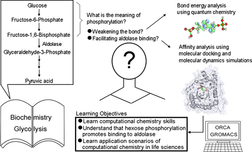

Computational chemistry is increasingly employed across diverse biological research domains, and proficiency in quantum chemistry and molecular dynamics software is essential for biochemistry education. Integrating computational chemistry into the life sciences curriculum enhances students’ understanding of its practical applications. However, existing pedagogical approaches often emphasize molecular modeling and dynamics simulations with a limited focus on developing quantum chemistry skills. Grounded in a problem-based learning framework, this study begins by examining the role of hexose phosphorylation within the glycolysis module of biochemistry courses. It introduces a comprehensive training program encompassing quantum chemistry and molecular dynamics simulation. Through this curriculum, students perform bond energy analyses using quantum mechanics and assess enzyme–substrate binding energies via molecular mechanics. In mastering foundational computational techniques, they gain deeper insight into the functional relevance of hexose phosphorylation in substrate recognition by aldolase and develop a robust appreciation for the broader applicability of computational chemistry in life science research.

# Reference

Nan Wu, et. al., J. Chem. Ed., 2025, [doi.org/10.1021/acs.jchemed.5c00571](https://doi.org/10.1021/acs.jchemed.5c00571)

